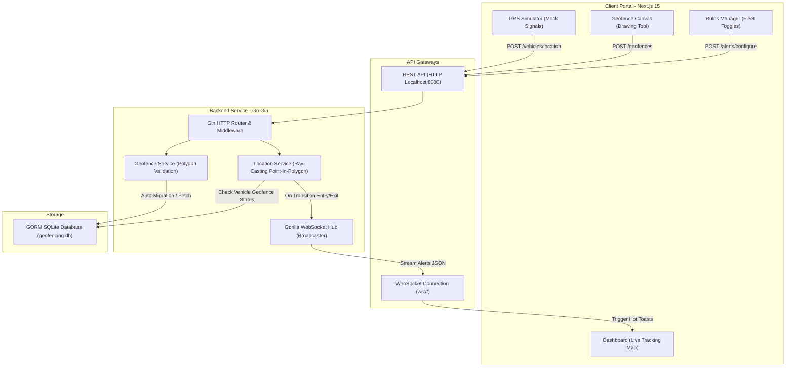

# 🛰️ MapUp Geofencing & Fleet Tracking Control Panel

[](https://opensource.org/licenses/MIT)
[](https://golang.org/)
[](https://nextjs.org/)
[](https://tailwindcss.com/)

An end-to-end, high-performance Geofencing Management and Real-Time Tracking system. Designed with a modular Go API backend (Gin + GORM SQLite) and a premium Next.js 15 client dashboard (Tailwind CSS v4 + React Leaflet).

The system enables fleet operators to draw boundary lines on map helpers, set target restriction rules, simulate real-time GPS coordinates, and view perimeter breach warning toasts streamed instantly over WebSockets.

---

## 🏛️ System Architecture

The following diagram illustrates the data flow and communication patterns across the application:



---

## 🛠️ Tech Stack

### Backend API
- **Language**: Go 1.23+
- **HTTP Framework**: Gin Gonic (fast, lightweight HTTP router)
- **Database / ORM**: GORM with pure Go SQLite driver (`github.com/glebarez/sqlite` - CGO-free)
- **Real-Time Engine**: Gorilla WebSocket Hub
- **Unit Testing**: Go testing package

### Frontend Portal
- **Framework**: Next.js 15 (App Router + React 19)
- **Language**: TypeScript
- **Styling**: Tailwind CSS v4 (native `@theme` configurations)
- **Maps Layout**: Leaflet 1.9 & React Leaflet 5 (loaded dynamically `ssr: false`)
- **Icons**: Lucide React
- **Notifications**: React Hot Toast

---

## ✨ System Features

*   **Custom Polygon Boundary Canvas**: Draw custom geofences on the map. Vertex counts, self-intersection, and zero-area geometries are validated before saving.
*   **Ray-Casting Calculation**: High-precision Point-in-Polygon logic that accurately supports complex, non-regular perimeter loops.
*   **Perimeter State Machine**: Detects actual *entry* and *exit* boundary transitions instead of spamming alerts on every point received inside a zone.
*   **WebSocket Warnings Hub**: Emits transition alerts to active clients instantly. Includes automatic connection retry algorithms on frontend dropouts.
*   **Interactive Location Simulator**: Mock GPS coordinate signals by clicking on the map, allowing operators to test boundary violations on any registered vehicle.
*   **Rules & Configuration Panel**: Configure geofence constraints globally (entire fleet) or target specific registered vehicle assets.
*   **Chronological Violation Audits**: Review detailed logging history records of all entry/exit breaches with filter query metrics.

---

## 📂 Repository Structure

```
mapup-geofencing/
├── backend/                  # Go Backend Service
│   ├── database/             # SQLite connection initialization
│   ├── handlers/             # REST route handlers & CORS middleware
│   ├── models/               # Database schemas & custom JSON marshaling
│   ├── services/             # Point-in-Polygon calculations & validation logic
│   │   ├── geofence_test.go  # Boundary validation unit tests
│   │   └── location_service_test.go # Detections state machine unit tests
│   ├── websocket/            # Gorilla WebSocket connection hub
│   ├── Dockerfile            # Lightweight Alpine deployment container
│   ├── docker-compose.yml    # Backend-only Docker Compose helper
│   └── README.md             # Backend routes description
│
├── frontend/                 # Next.js Frontend App
│   ├── src/
│   │   ├── app/              # Dashboard, Geofences, Vehicles, Alerts, Violations pages
│   │   ├── components/       # Maps and fixed glass side navigation elements
│   │   ├── context/          # Live alert context and toast broadcaster
│   │   └── services/         # Axios API backend client
│   ├── Dockerfile            # Multi-stage Next.js production Dockerfile
│   └── README.md             # Frontend setups documentation
│
├── docker-compose.yml        # ROOT orchestrator (launch both API and Web)
├── walkthrough.md            # Technical decisions and code audits overview
├── submission.md             # Submission audit grading and checklist report
└── .gitignore                # Root-level git exclusions list
```

---

## 🚀 Getting Started

### 🐳 1-Click Run (Docker Compose)
To launch the entire stack (Go backend API + Next.js frontend + persistent storage) immediately, run from the root directory:
```bash
docker compose up --build
```
- **Control Panel Dashboard**: [http://localhost:3000](http://localhost:3000)
- **REST API Server**: [http://localhost:8080](http://localhost:8080)
- **WebSocket Alerts**: `ws://localhost:8080/ws/alerts`

---

### 💻 Manual Local Running

#### 1. Setup & Start Backend
Ensure Go is installed. Run the commands in a separate terminal:
```bash
cd backend
go run main.go
```
The server will boot on `http://localhost:8080`. The database file `geofencing.db` will be initialized in the same directory.

#### 2. Setup & Start Frontend
Ensure Node.js 18+ is installed. Run the commands in a separate terminal:
```bash
cd frontend
npm install
npm run dev
```
The client page will run on `http://localhost:3000`.

---

## 📡 API Overview & Endpoints

All REST API responses return execution metrics in `time_ns` for evaluation benchmarking.

| Method | Endpoint | Description | Payload Example |
|---|---|---|---|
| **POST** | `/geofences` | Create a geofence zone | `{"name": "Warehouse", "polygon": [{"lat":0,"lng":0}, ...]}` |
| **GET** | `/geofences` | List all geofences | Response: `{"time_ns": 1250, "data": [...]}` |
| **POST** | `/vehicles` | Register vehicle | `{"name": "Truck-01"}` |
| **GET** | `/vehicles` | List all vehicles | Response: `{"time_ns": 820, "data": [...]}` |
| **POST** | `/vehicles/location` | Record coordinates | `{"vehicle_id": 1, "lat": 5.23, "lng": 6.82}` |
| **GET** | `/vehicles/location/:id` | Get tracking history | Response: `{"time_ns": 940, "data": [...]}` |
| **POST** | `/alerts/configure` | Set alert rules | `{"geofence_id": 1, "vehicle_id": 1, "alert_type": "both"}` |
| **GET** | `/violations/history` | Get audit breach logs | Query params: `vehicle_id`, `geofence_id`, `limit` |

---

## 🔌 WebSocket Alerts Stream
- **Endpoint**: `ws://localhost:8080/ws/alerts`
- **Behavior**: Broadcasts a JSON string payload immediately upon detecting vehicle perimeter crossings.
- **Payload Schema**:
```json
{
  "time_ns": 987123,
  "data": {
    "violation_id": 12,
    "geofence_id": 1,
    "vehicle_id": 1,
    "type": "entry",
    "lat": 5.0,
    "lng": 5.0,
    "timestamp": "2026-06-14T23:30:00Z",
    "message": "Vehicle UP65AB1234 entered Geofence Test Zone"
  }
}
```

---

## 🧪 Testing Instructions

Run the backend test suites verifying polygon intersection validation constraints, vertex stripping, configuration upserts, and location transition state detections:
```bash
cd backend
go test -v ./...
```

---

## 📸 Screenshots

Below are visual layouts representing key views from the Geofencing Control Panel Dashboard:

### 1. Operations Control Center (Dashboard)
`[Dashboard Layout: Main map displaying overlapping active geofence boundaries, current real-time pulsing vehicle nodes, and scrolling WebSocket alert notifications]`

### 2. Interactive Polygon Drawing Canvas (Geofences)
`[Geofence Page: Sidebar geofence form, map coordinate vertex placements, coordinate list viewer, and registered perimeters listings]`

### 3. Location simulator & Timeline Audits (Vehicles)
`[Vehicles Page: Asset registration, simulator panel, coordinates map picker, and chronological vehicle tracking logs]`

---

## 🚀 Production Improvements & Scaling Plan

1.  **PostGIS Spatial Queries**: Replace GORM SQLite with PostgreSQL + PostGIS, enabling database-optimized `ST_Contains` spatial checks rather than loading arrays in memory.
2.  **Redis Coordinates Caching**: Store the latest coordinates and current state of active vehicles in a Redis cluster to minimize disk writes on GORM history tables.
3.  **WSS Secure Connections**: Encrypt WebSocket feeds using WSS protocols and enable JSON Web Token (JWT) credentials authentication.
4.  **Kafka Event Streaming**: Feed GPS signal streams into an Apache Kafka cluster to distribute tracking calculations across multiple cluster instances.
